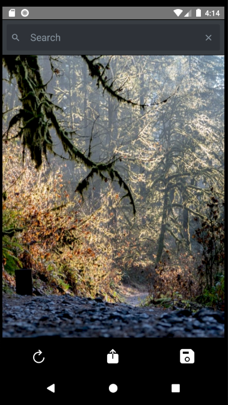
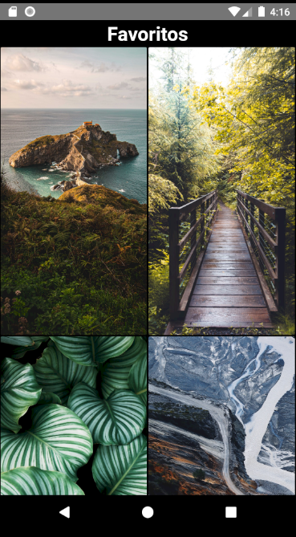
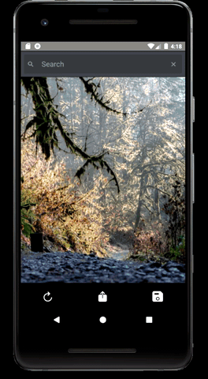
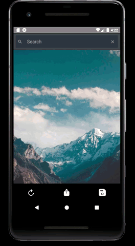
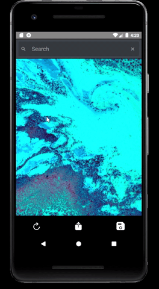

# Wallpaper React Native

Wallpaper app with a bare react native project and the unsplash api.

## App
Home Page            |  Favorites Page
:-------------------------:|:-------------------------:
  |    

Search for a wallpaper            |  Like a wallpaper
:-------------------------:|:-------------------------:
  |    

Share a wallpaper         |  Save a wallpaper
:-------------------------:|:-------------------------:
  |  
